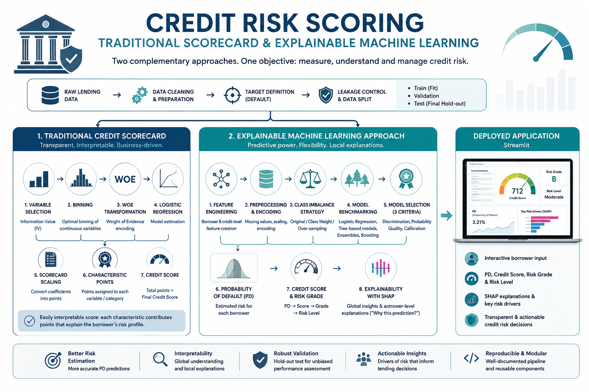
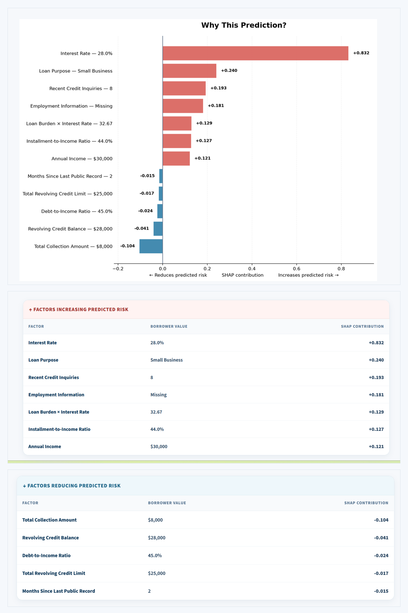
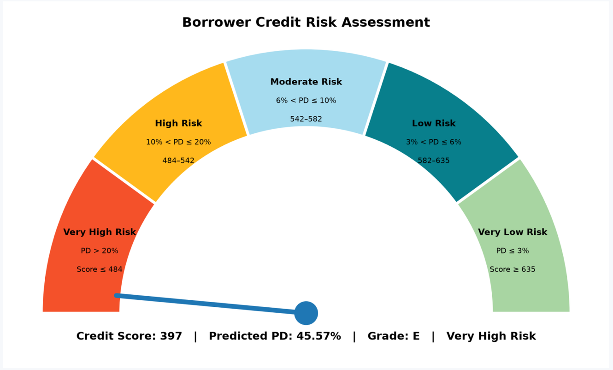

# Credit Risk Scoring

## Traditional Scorecard & Explainable Machine Learning

An end-to-end credit risk analytics project comparing two complementary approaches to Probability of Default (PD) estimation and credit scoring:

- a **traditional credit scorecard**, based on Information Value (IV), Weight of Evidence (WOE), logistic regression and point-based scoring;
- an **explainable machine learning approach**, based on feature engineering, model benchmarking and selection, PD-based credit scoring, and borrower-level SHAP explanations.

The project combines predictive modeling, interpretability and credit risk analytics within a reproducible framework. The selected machine learning pipeline is operationalized through an interactive Streamlit application.

<p align="center">
  
</p>

## Project Overview & Objective

Financial institutions need to estimate borrower default risk while maintaining **predictive performance, interpretability, and reliable risk estimation**. This project addresses this challenge by developing two complementary approaches to borrower-level **Probability of Default (PD)** estimation and credit scoring.

A **traditional credit scorecard** emphasizes transparency through IV/WOE-based modeling, logistic regression, and characteristic-level points, while an **explainable machine learning framework** benchmarks multiple models using discrimination, probability quality, and calibration. The selected ML model translates predicted PD into a credit score and risk classification, with SHAP providing borrower-level explanations.

## End-to-End Methodology

Both approaches share a common data foundation before branching into two complementary credit-scoring frameworks.

**Common pipeline**

`Raw Lending Data → Data Cleaning → Target Definition → Leakage Control → Train / Validation / Test Strategy`

| Traditional Credit Scorecard | Explainable Machine Learning |
|---|---|
| Binning & WOE analysis | Credit-risk feature engineering |
| IV-based variable selection | Model-specific preprocessing & encoding |
| Logistic regression | Multiple candidate models |
| Characteristic-level points | Model benchmarking & selection |
| Point-based credit score | PD-based credit score & risk grade |
| Intrinsic interpretability | Borrower-level SHAP explanations |


## Traditional Credit Scorecard

The traditional approach prioritizes **transparency and business interpretability**, allowing the contribution of borrower characteristics to be traced directly to the final score.

**Modeling pipeline**

`Candidate Variables → Binning & WOE Analysis → IV-based Variable Selection → Logistic Regression → Scorecard Scaling → Characteristic Points → Credit Score`

Variables are grouped into risk-homogeneous bins and transformed using **Weight of Evidence (WOE)**, while **Information Value (IV)** supports the selection of discriminatory predictors. Logistic regression then estimates default risk, and its coefficients are converted into characteristic-level points to produce an interpretable credit score.

## Explainable Machine Learning Approach

The machine learning approach combines **credit-risk feature engineering, model-specific preprocessing, and a benchmark-and-challenger framework** to estimate borrower-level PD.

**Modeling pipeline**

`Feature Engineering → Preprocessing → Imbalance Analysis → Model Benchmarking → Hyperparameter Tuning → Validation-Based Selection → Final PD Model`

Class imbalance strategies—including the original distribution, class weighting, and random oversampling—are evaluated with particular attention to probability reliability. Candidate models are then tuned and compared using three complementary dimensions:

| Dimension | Metrics |
|---|---|
| **Discrimination** | ROC-AUC, Gini, KS |
| **Probability Quality** | Brier Score, Log Loss |
| **Calibration** | Predicted PD vs. Observed Default Rate |

Model selection is performed on validation data, while the external test set remains untouched until final evaluation.


## Model Selection & Results

Candidate models were compared on the same validation sample across discrimination and probability-quality metrics.

| Model | ROC-AUC ↑ | Gini ↑ | KS ↑ | Brier ↓ | Log Loss ↓ |
|---|---:|---:|---:|---:|---:|
| **Histogram Gradient Boosting** | **0.7055** | **0.4110** | **0.2995** | **0.0918** | **0.3182** |
| Random Forest | 0.7002 | 0.4004 | 0.2922 | 0.0922 | 0.3199 |
| Logistic Regression — L1 | 0.6927 | 0.3854 | 0.2819 | 0.0927 | 0.3221 |
| Decision Tree | 0.6778 | 0.3556 | 0.2589 | 0.0935 | 0.3254 |

**Histogram Gradient Boosting** was selected as the champion model, achieving the strongest discrimination and the best probability-quality metrics among the evaluated candidates.

### Final Out-of-Sample Performance

The frozen model specification was refitted on the complete development sample and evaluated once on the untouched test set.

| Stage | ROC-AUC | Gini | KS | Brier | Log Loss | Mean PD | Default Rate |
|---|---:|---:|---:|---:|---:|---:|---:|
| Validation | 0.7055 | 0.4110 | 0.2995 | 0.0918 | 0.3182 | 10.93% | 10.93% |
| **Test** | **0.7020** | **0.4039** | **0.2973** | **0.0920** | **0.3191** | **10.91%** | **10.93%** |

Performance remained stable out of sample, while the test mean predicted PD (**10.91%**) closely matched the observed default rate (**10.93%**).

## From Probability of Default to Credit Score

The champion model estimates a borrower-level **Probability of Default (PD)**, which is transformed into intuitive risk indicators through a dedicated scoring layer.

**Scoring pipeline**

`Predicted PD → Credit Score → Model Risk Grade → Overall Risk Level`

A lower predicted PD corresponds to a higher credit score, which is then mapped to ordered risk categories for easier interpretation.
## Borrower-Level Explainability with SHAP

While the traditional scorecard is intrinsically interpretable, the ML model uses **SHAP (SHapley Additive exPlanations)** to explain individual predictions.

> **Why did this borrower receive this predicted PD?**

SHAP decomposes each prediction relative to a baseline, identifying and ranking the borrower characteristics that push predicted risk **higher or lower**.

`Baseline Risk + Feature Contributions → Borrower-Specific Prediction`

The Streamlit application translates these contributions into readable risk drivers, a visual explanation, and dynamic tables tailored to each borrower.

> **Interpretation note:** SHAP explains the model's prediction, not causal relationships.

### Example of a Borrower-Level Explanation

<p align="center">
  
</p>

## Streamlit Application

The selected ML pipeline is operationalized through an interactive **Streamlit application**, providing an end-to-end borrower-level credit-risk assessment.

`Borrower Inputs → PD Prediction → Credit Score & Risk Classification → SHAP Explanation`

The application combines model prediction, scoring, risk visualization, and borrower-specific explainability within a single interface.

### Example of the Credit Risk Assessment

<p align="center">
  
</p>

**Live Application:** (https://risk-credit-scoring-2026-08.streamlit.app/)


## Repository Structure & Reproducibility

```text
risk-credit-scoring/
├── app.py                         # Streamlit credit-risk application
├── assets/                        # Figures and application screenshots
│
├── data/
│   ├── raw/                       # Original Lending Club data
│   ├── interim/                   # Intermediate datasets
│   └── processed/                 # Modeling and deployment datasets
│
├── models/
│   ├── pd/                        # Trained PD models and evaluation results
│   └── pd_binning/                # WoE / logistic scorecard artifacts
│
├── notebooks/                     # Main PD modeling workflow
├── notebooks_LR/                  # WoE / logistic regression workflow
│
├── src/
│   ├── features/                  # Feature engineering and WoE utilities
│   ├── modeling/                  # Model evaluation utilities
│   └── scorings/                  # Scorecard prediction utilities
│
├── .streamlit/
│   └── config.toml                # Streamlit configuration
│
├── requirements.txt               # Application dependencies
├── requirements-dev.txt           # Development dependencies
├── RUNNING_THE_PROJECT.md         # Execution instructions
├── setup_env.ps1                  # Windows environment setup
├── setup_env.sh                   # Unix/Git Bash environment setup
└── README.md                      # Project documentation
```

### Running the Application

```bash
git clone https://github.com/HTOUYEM/risk-credit-scoring.git
cd risk-credit-scoring

python -m venv .venv
source .venv/Scripts/activate

python -m pip install --upgrade pip
python -m pip install -r requirements.txt
python -m streamlit run app.py
```

For notebook development:

```bash
python -m pip install -r requirements-dev.txt
```

> **Data note:** large raw and processed datasets are excluded from version control.


## Contributors

This project was developed collaboratively through two complementary credit-risk modeling approaches:

- **Traditional Credit Scorecard:** Platini Agouanet 
- **Explainable Machine Learning & Application:** Hilaire Touyem

Both approaches contribute to the same objective: building interpretable and actionable credit-risk scoring frameworks.

## Credit Risk & Tech Stack

**Credit Risk:** Probability of Default (PD) · Credit Scoring · IV/WOE · Risk Ranking · Model Calibration · Model Validation · Explainability

**Modeling:** Logistic Regression · Decision Tree · Random Forest · Histogram Gradient Boosting · SHAP

**Tech:** Python · pandas · NumPy · scikit-learn · Matplotlib · Streamlit · Joblib

## Limitations & Future Work

This project focuses on **Probability of Default (PD) and credit scoring** and is intended for analytical and educational purposes rather than production lending decisions. Production use would require additional model governance, fairness assessment, regulatory validation, and ongoing performance and data-drift monitoring.

Future work will extend the framework toward a more comprehensive credit-risk modeling system through **Loss Given Default (LGD)** and **Exposure at Default (EAD)** modeling, enabling the estimation of:

**Expected Loss = PD × LGD × EAD**

Further extensions could explore the integration of these risk components within broader **IFRS 9 credit-risk modeling considerations**, including expected credit loss assessment and model monitoring.

> **Disclaimer:** The scores, risk grades, and predictions produced by this project should not be interpreted as actual lending recommendations.

## License

Copyright © 2026 Hilaire Touyem and Franklin Platini Agouanet.

This project is publicly available for educational, demonstration, recruitment,
and portfolio purposes. Reproduction, modification, redistribution, or
commercial use is not permitted without prior written authorization from the
authors.

See the [LICENSE](LICENSE) file for details.
